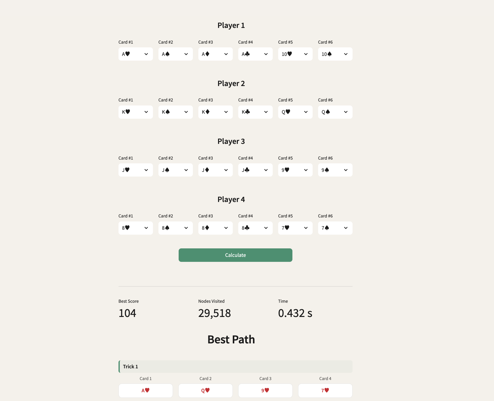

# Baloot AI

An interactive tool that computes the optimal card play in the Saudi card game **Baloot** using **Minimax with Alpha-Beta Pruning**, simulating all possible futures to determine the best possible outcome for each team.

The project includes:

- **Streamlit App** – An interactive frontend to input current player hands and simulate the optimal sequence of moves.
- **Minimax Backend** – A complete implementation of the minimax algorithm with alpha-beta pruning to efficiently compute the best possible play sequence.
- **Archived MCTS Notebook** – An early exploration using Monte Carlo Tree Search (MCTS) with UCB1 and rollouts before transitioning to minimax.

---

🔗 **Live Demo**  
👉 Launch the app here: [https://baloot-ai.streamlit.app](https://baloot-ai.streamlit.app)

---

📷 **Screenshot**  

---

## 📊 Features

- Input interface for selecting player hands
- Optimal card sequence calculation using Minimax with alpha-beta pruning
- Turn-based logic with trick suit and score computation
- Live result display with final team score and play order
- Archived MCTS implementation for reference

---

## 📓 Notebooks

- **minimax.ipynb** – Main algorithm with game state simulation and performance metrics.
- **archive/mcts.ipynb** – An initial experiment using MCTS with UCB1 scoring and rollouts. Eventually replaced by minimax for deterministic optimization.
